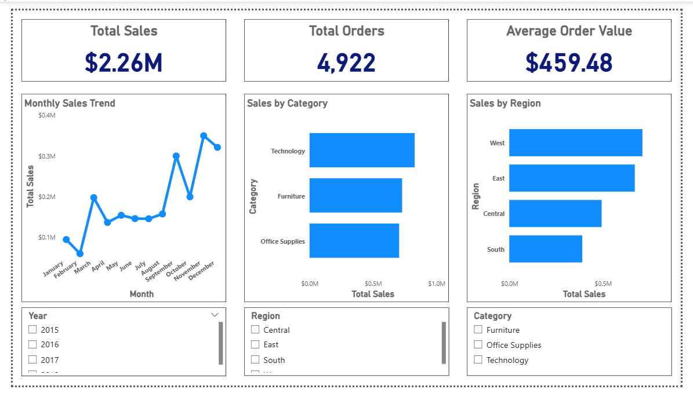

# Sales & Revenue Intelligence Dashboard

## 📌 Project Overview
This project focuses on analyzing sales performance and revenue trends to support business decision-making.
An interactive Power BI dashboard was built using cleaned and structured data to track KPIs, identify patterns, and compare performance across categories and regions.

---

## 🧰 Tools & Technologies Used
- Microsoft Excel (Power Query for data cleaning)
- Power BI
- DAX (Data Analysis Expressions)

---

## 📊 Key KPIs
- Total Sales
- Total Orders
- Average Order Value (AOV)

---

## 📈 Dashboard Features
- Monthly sales trend analysis
- Sales by product category
- Sales by region
- Interactive slicers for Year, Category, and Region

---

## 🖼️ Dashboard Preview

### Full Dashboard


### KPI Section


---

## 📂 Project Structure
```
Sales-Revenue-Intelligence/
├── dashboard/
│ └── Sales_Revenue_Intelligence.pbix
├── data/
│ └── sales_cleaned.xlsx
├── screenshots/
│ ├── dashboard_overview.png
│ └── kpi_section.png
└── README.md
```


---

## 🔍 Key Insights
- Technology is the highest revenue-generating category
- The West region outperforms other regions in total sales
- Sales show an overall upward trend with seasonal patterns

---

## 💡 Business Recommendations
- Focus marketing efforts on high-performing categories
- Improve sales strategies in low-performing regions
- Plan inventory and promotions based on demand trends

---

## 🚀 Outcome
This project demonstrates end-to-end data analytics skills including data cleaning, KPI creation using DAX, interactive dashboard development, and business insight generation.
